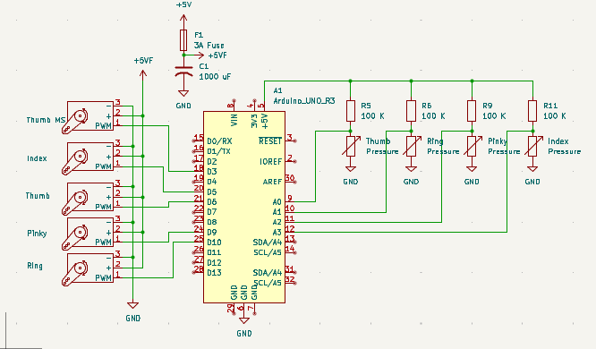

# Robotic Hand PID Servo Controller

This Arduino project provides a C++ class called `Finger`, which controls a servo motor using input from an analog sensor and a PID (Proportional-Integral-Derivative) control loop. It's designed to smoothly and accurately move the servo based on sensor feedback.

---

## Features

- Object-oriented class to control a servo via PID
- Adjustable PID tuning based on proximity to target
- Easy integration with other Arduino projects
- Uses `Servo.h` and `PID_v1.h` libraries

---

## Hardware Required

- Arduino board
- Analog input sensor (e.g., potentiometer, flex sensor) this project uses circular pressure sensors 
- Servo motor
- Jumper wires
- 1000 uF Capacitor

---

## Circuit Diagram

Servo motors typically have three wires:  
- **Red**: VCC (connect to Arduino 5V)  
- **Brown/Black**: GND  
- **Yellow/Orange/White**: Signal (connect to Arduino PWM pin, e.g., D9)

Analog sensor (e.g., potentiometer or flex sensor) should be connected to an analog input pin (e.g., A0).

### Schematic 


---

## Installation

1. Clone or download this repo.
2. Make sure you have the following Arduino libraries installed:
   - `Servo`
   - `PID_v1`
3. Include the `Finger.h` and `Finger.cpp` files in your Arduino sketch.

---

## Usage Example

```cpp
#include "Finger.h"

Finger finger(A0, 9, 100); // analog input pin, servo pin, and setpoint

void setup() {
  finger.begin();
}

void loop() {
  finger.update();
}
